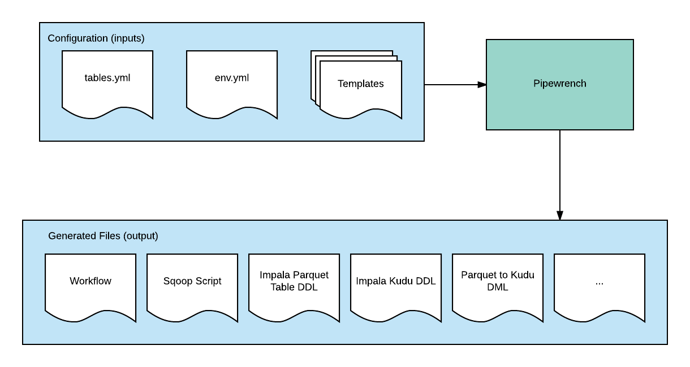
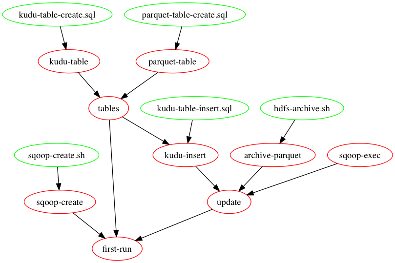

<p align="center">
  


  <h3 align="center">Pipewrench</h3>

  <p align="center">
    Data pipeline automation framework.
    <br>

  </p>
</p>

<br>


- [Introduction](#introduction)
- [Prerequesites and Dependencies](#prerequesites-and-dependencies)
- [Concepts and Architecture](#concepts-and-architecture)
  * [tables.yml](#tablesyml)
  * [env.yml](#envyml)
  * [Pipeline-template](#pipeline-template)
  * [Pipeline-config](#pipeline-config)
  * [Pipeline](#pipeline)
  * [pipewrench-merge](#pipewrench-merge)
  * [Workflow Orchestration with Make](#workflow-orchestration-with-make)
- [Pipelines](#pipelines)
  * [sqoop-parquet-hdfs-kudu-impala](#sqoop-parquet-hdfs-kudu-impala)
  * [sqoop-parquet-hdfs-impala](#sqoop-parquet-hdfs-impala)
- [Getting Started](#getting-started)
  * [Installation](#installation)
  * [Generating a Pipeline](#generating-a-pipeline)
  * [Generating Config](#generating-config)
  * [Running Scripts](#running-scripts)
- [Running Scripts for All Tables](#running-scripts-for-all-tables)
- [Configuring and Extending Pipewrench](#configuring-and-extending-pipewrench)
  * [Creating Templates](#creating-templates)
  * [Importing templates](#importing-templates)
  * [Mapping datatypes](#mapping-datatypes)
- [Using the Logging Script - run-with-logging.sh](#using-the-logging-script---run-with-loggingsh)
- [Testing](#testing)

## Introduction
Pipewrench is framework that generates, deploys, and orchestrates data pipelines. Pipewrench will generate text 
config to ingest multiple tables from a single configuration and a set of templates.

Pipewrench is designed to be flexible. Exsiting pipelines are designed to be easily modified and new configuration can
be added by creating new templates.

Example pipelines are located in the [templates directory](./templates) and new pipelines can be created by users.

When Pipewrench is run, its inputs are a tables.yml (config), env.yml (environment), and templates. The output is 
bash scripts and text config (for example: Impala DDL, sqoop scripts, Kafka Connector json configuration, 
or Avro schemas).



## Prerequesites and Dependencies
Pipewrench runs on Unix systems and uses these technologies:
- [Python](https://docs.python.org/3/) 2.7+: The main transformation logic uses python
per project
- [Yaml](http://www.yaml.org/start.html): Yaml is a human friendly data serialization language used for defining 
configuration. [Tutorial](http://docs.ansible.com/ansible/latest/YAMLSyntax.html))
- [Jinja2](http://jinja.pocoo.org/docs/2.9/): is a templating language for defining configuration files with variables
 that can be populated by values from the `tables.yml`
- [Make](https://www.gnu.org/software/make/): Make is a build tool but due to it's dependency based model it is a
 great tool for creating, removing, and orchestration data pipelines. [Tutorial](http://keleshev.com/yaml-quick-introduction)
- [Bash](https://www.gnu.org/software/bash/): bash scripts are used to automate workflows

## Concepts and Architecture

### tables.yml
Pipewrench creates and executes pipelines based off of a global yaml configuration file (`tables.yml`). The 
tables.yml file defines source database, tables, columns, and datatypes.

See [here](examples/sqoop-parquet-hdfs-kudu-impala/tables.yml) for an example tables.yml with documentation
### env.yml
The tables.yml file itself is a jinja template. Variables from the env.yml file are automatically added to the
 tables.yml file before any configuration is generated. See an example env.yml [here](examples/sqoop-parquet-hdfs-kudu-impala/env.yml)

### Pipeline-template
A pipeline is a directory of templates. When Pipewrench is executed with a pipeline-template directory and
tables.yml, it will output a pipeline.

### Pipeline-config
A pipeline-confing is is set of configuration files that can be applied to create data pipelines. It is the result 
of running the pipewrench-merge.

```bash
pipewrench-merge --conf=tables.yml \
                 --debug_level DEBUG \
                 --env=env.yml \
                 --pipeline-templates=../../templates/sqoop-parquet-hdfs-kudu-impala
```

### Pipeline
A pipeline is a running instance of a pipeline-config.

### pipewrench-merge 
`pipewrench-merge` is a cli application that takes the `env.yml`, `tables.yml`, and a `templates` directory
to create pipeline configuration.

### Workflow Orchestration with Make
GNU Make uses a [dependency based](https://martinfowler.com/articles/rake.html#DependencyBasedProgramming)
computation model that allows an engineer to define a task such that the task won't be run until all of its
dependencies have been satisified. Make is used vi a Makefile defined in the root of a pipeline. 

If a pipeline requires that data be inserted into Kudu. Dependencies are defined for the insert, so that Make can
ensure that the the Kudu table is created before the data is pulled in from the database.

## Pipelines

### sqoop-parquet-hdfs-kudu-impala
The [sqoop-parquet-hdfs-kudu-impala](./templates/sqoop-parquet-hdfs-kudu-impala) pipleline will use Sqoop job to pull data from a relational database 
into Parquet, then insert that data into Kudu.

See the documenation for the sqoop-parquet-hdfs-kudu-impala pipeline [here](./templates/sqoop-parquet-hdfs-kudu-impala/README.md) 

### sqoop-parquet-hdfs-impala
The [sqoop-parquet-hdfs-impala](./templates/sqoop-parquet-hdfs-impala) pipleline will use Sqoop job to pull data from a relational database 
into Parquet

See the documenation for the sqoop-parquet-hdfs-impala pipeline [here](./templates/sqoop-parquet-hdfs-kudu-impala/README.md) 

## Getting Started

### Installation
Install Pipewrench, its dependencies, and the `pipewrench-merge` script:

```bash
$ python setup.py install
```

now the `pipewrench-merge` command will be available on your `$PATH`

### Generating a Pipeline
Example project scripts are located in the `examples` directory. Each example will have a slightly different
yaml requirements. All examples include the following files:

- tables.yml: an example project configuration file. Databases and tables will be defined here
- env.yml: an environment yaml file.
- generate-scripts: a helper script to build config with the `pipeline-merge` executable

The pipeline will be generated from the `./templates` directory. It is is further divided into 'pipelines'.
Here one pipeline is defined called 'sqoop-parquet-hdfs-kudu-impala'

```bash
$ ls templates/
sqoop-parquet-hdfs-kudu-impala/
```

### Generating Config
Generating scripts will apply the configuration to the templates in a pipeline, giving executable configuration
such as Impala DDL, helper Bash scripts, or Streamsets pipelines in JSON.

Generate scripts using the `generate-scripts` helper:

```bash
$ cd project-scripts
$ ./generate-scripts

```

Running `pipewrench-merge` from the `examples` directory manually would look like:

```bash
pipewrench-merge --conf=tables.yml \
                 --debug_level DEBUG \
                 --env=env.yml \
                 --pipeline-templates=../../templates/sqoop-parquet-hdfs-kudu-impala
```

Now you should see files created in the `output` directory:

```bash
$ ls output/sqoop-parquet-hdfs-kudu-impala/first_imported_table
Makefile        kudu-table-count.sql   kudu-table-drop.sql    parquet-table-create.sql  sqoop-create.sh  sqoop-exec.sh
hdfs-delete.sh  kudu-table-create.sql  kudu-table-insert.sql  parquet-table-drop.sql    sqoop-delete.sh  test.sh
```

The 'sqoop-parquet-hdfs-kudu-impala' pipeline has been created for one table 'first_imported_table'.


### Running Scripts
The scripts can be executed by themselves or using the included Makefile.

Use `make help` to see all targets and documentation:

```bash
$ cd output/sqoop-parquet-hdfs-kudu-impala/first_imported_table
$ make help
...
sqoop-create: sqoop-create.sh ## Create Sqoop job
...
```

To see what a target does, run it with the `-n` flag:

```bash
$ make -n first-run
sh sqoop-create.sh || true
cp sqoop-create.sh sqoop-create
sh sqoop-exec.sh
touch sqoop-exec
/bin/impala-shell -k --ssl -i impala-daemon.company.com -f  parquet-table-create.sql
cp parquet-table-create.sql parquet-table
/bin/impala-shell -k --ssl -i impala-daemon.company.com -f  kudu-table-create.sql
cp kudu-table-create.sql kudu-table
/bin/impala-shell -k --ssl -i impala-daemon.company.com -f  kudu-table-insert.sql
rm sqoop-exec ## move kudu parquet to archive

```

Here is the dependency graph for `make first-run`



To run a target from another directory, include the file path:

```bash
make -n first-run -C output/sqoop-parquet-hdfs-kudu-impala/first_imported_table
```

## Running Scripts for All Tables

The MasterMakefile in the project directory has two targets: first-run-all and update-all. To ingest all tables
listed in tables.yml run first-run-all:

make first-run-all

To update all tables in tables.yml run update-all:

make update-all
## Configuring and Extending Pipewrench

### Creating Templates
Templates use the [Jinja2](http://jinja.pocoo.org/docs/2.9/) templating language.  Any file put in a pipeline
directory (`templates/<your-pipeline>`) will be rendered. All pipeline templates (that don't have the ".meta" 
file extension) are called with a `conf` variable and a `table` variable corresponding to the tables.yml structure.

Templates with the ".meta" file extension are rendered separately. These templates are called with a `conf` 
variable and a `tables` variable. They are used to generate files that affect all tables, such as MasterMakefile. These files are stored in the project directory.

This example template creates a Parquet table through Impala::

```bash
USE {{ conf.staging_database.name }};
CREATE EXTERNAL TABLE IF NOT EXISTS {{ table.destination.name }}_parquet (

{{ column.name }} {{ map_datatypes(column).parquet }} COMMENT '{{ column.comment }}'
, 
)
STORED AS Parquet
LOCATION '{{ conf.staging_database.path }}/{{ table.destination.name }}';
```

### Importing templates
Templates can be imported from another template directory by putting a relative path to another template
in an 'imports' file. 

This will import a shared sqoop template into a pipeline:

```bash
$ ../shared/sqoop-create.sh
```

### Mapping datatypes
Data type mappings from the source to destination database are defined in these configuration properties:

```snakeyaml
type_mapping: type-mapping.yml # Type mapping used for database type conversion
```

The mapping file will map source database types to destination types including Impala, Kudu, Parquet, Avro,
or any other type.

For example, the contents of type-mapping.yml might look like:

```snakeyaml
datetime:
  kudu: bigint
  impala: bigint
  parquet: bigint
  avro: long
bigint:
  kudu: bigint
  impala: bigint
  parquet: bigint
  avro: long
decimal:
  kudu: double
  impala: decimal
  parquet: double
  avro: double
string:
  kudu: string
  impala: string
  parquet: string
  avro: string
```

The mapping function can be used in a template to get a Kudu dataype:

```snakeyaml
{{ map_datatypes(column).kudu }}
```

or an Avro datatype
```snakeyaml
{{ map_datatypes(column).avro }}
```

## Using the Logging Script - run-with-logging.sh

`run-with-logging.sh` creates a log directory in every table folder with a status log and complete log output
files are in the current date sub directory.

Run your command by passing it as a parameter to this script, example:

```bash
$ sh run-with-logging.sh <command>
```

## Testing
Tests for pipelines are located in the template `test` dir. 

Individual template tests and template rendering tests can be run with the command 

```bash
$ python -m pytest
```

All template tests can be run in the project root dir
```bash
$ make test-templates
```

Tests are helpful for working through template design, but integration tests with tools like Impala or Kafka should
be run and will probably be more useful than just testing template output.

Render all example pipelines with

```bash
$ make test-render-templates
```

Run all tests

```bash
$ make test
```
