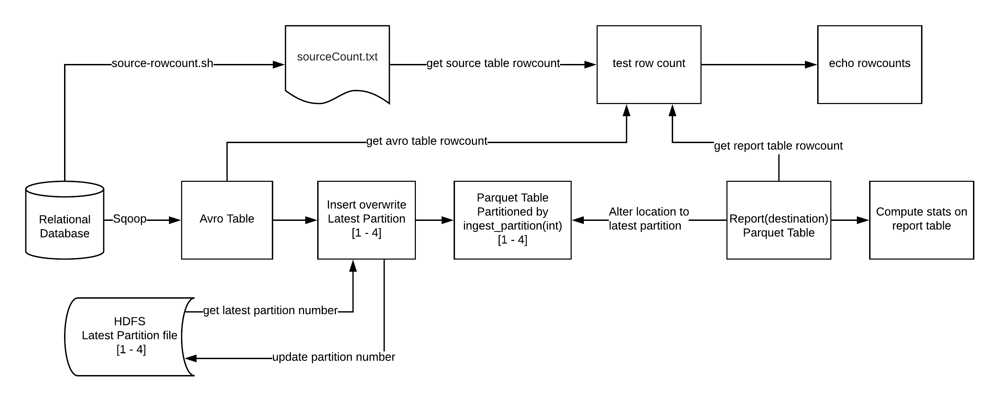

# Sqoop to IMPALA Pipeline
This pipeline will sqoop data into a Avro (staging) table insert data to Parquet table with partitions and creates destination table pointing the location to fresh copy of data inserted

## Artifacts Created
- Impala Avro table
- Impala Parquet table with partitions
- Impala Parquet (Destination) table 
- Sqoop import job

## Pipeline Flow

## Running the pipeline

`make first-run` :
- Get the source table rowcount and save the count in a text file(sourceCount.txt).
- Delete the AVRO schema if exists
- Sqoop import into AVRO data format
- Copy avro schema to the correct location 
- Create AVRO table if not exists, on top of sqooped data.
- Create a parquet table if not exists, partitioned by ingest_partition(int)
- Invalidate metadata on AVRO table
- Create report(final) table if not exists, stored as parquet
- alter-tables
  - Check if partition file named 'latest_partition' exists in HDFS.
  - If not, script sets the value of partition_number to 1
  - Insert overwrite data from AVRO table into partitioned parquet table where ingest_partition=1
  - Alter location of report(final) table to latest partition file(ingest_partition=1)
  - Remove the partition file named 'latest_partition' if exists
  - Create a partition file named 'latest_partition' with integer 1 in it.
- Compute stats on report(final) table
- Compare and display row count from source table, avro table, and report table.

`make update` :
- Get the source table rowcount and save the count in a text file(sourceCount.txt).
- Delete the AVRO schema if exists
- Sqoop import into AVRO data format
- Copy avro schema to the correct location
- Create a parquet table if not exists, partitioned by ingest_partition(int)
- Invalidate metadata on AVRO table
- Create report(final) table if not exists, stored as parquet
- alter-tables
  - Check if partition file named 'latest_partition' exists in HDFS.
  - Get the number from the partition file named 'latest_partition'(This file was generated after first-run and has number 1 in it).
  - Add 1 to the partition number.
  - Insert overwrite data from AVRO table into partitioned parquet table where ingest_partition=2
  - Alter location of report(final) table to latest partition file(ingest_partition=2)
  - Remove the partition file named 'latest_partition' if exists
  - Create a partition file named 'latest_partition' with integer 2 in it.
- Compute stats on report(final) table
- Compare and display row count from source table, avro table, and report table.

`make clean` :
 - Clean data for avro, partitioned and report table.
 - Drop avro, partitioned and report tables if exists.

`make integration-test` :
 - make clean
 - make first-run
 - make update
 - Compare and display row count from source table, avro table, and report table.
