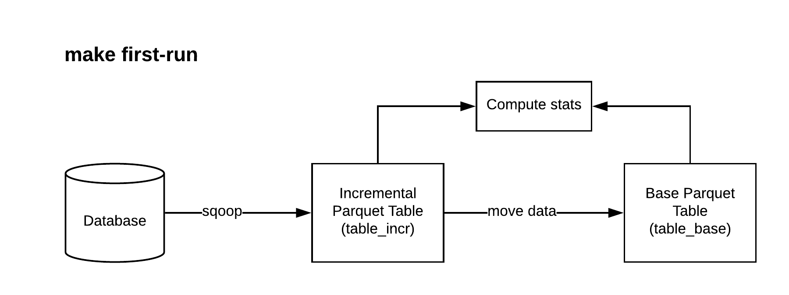
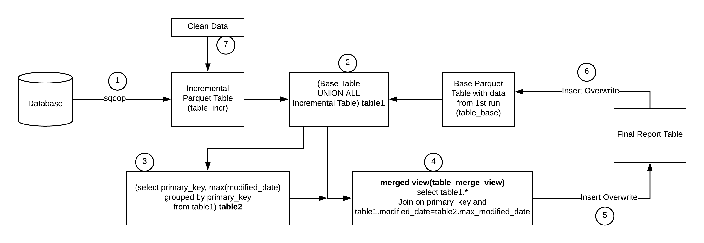

# Sqoop Parquet HDFS Hive Merge
- This pipeline will perform incremental updates using sqoop and parquet tables 
- Source table must have "modified_date" and "primary_key"
- This template automates the steps defined in the blog post [here](https://hortonworks.com/blog/four-step-strategy-incremental-updates-hive/) 

## Artifacts Created
- Base Parquet Table
- Incremental Parquet Table
- Report Parquet Table
- Merged View
- Sqoop Import Job

## Running the pipeline

`make first-run` :

 

- Create base parquet table named as 'table_base' and compute stats on it
- Create and Execute the sqoop job
- Move sqooped parquet data from incremental table location(/user/db/table/incr) to base table location(/user/db/table/base)
- Create an incremental parquet table named as 'table_incr' and compute stats on it

`make update` : 

 

- Execute the sqoop job
- Create merged view named 'table_merge_view':
  - select primary key and max of modified_date from union of base table(table_base) and incremental table(table_incr)
  - join union of base table(table_base) and incremental table(table_incr)
  - on primary keys and modified_date=max_modified_date
- Drop/create reoprt table named 'table_report' and overwrite report table with records from merged view(table_merge_view)
- Overwrite base table(table_base) with records from report table(table_report)
- Clear the data from incremental table location(/user/db/table/incr)

`make clean` : 
- Drop base, incremental tables and merged view
- Clean table data from HDFS(/user/db/table)
- Drop report table and clean data
- Delete the sqoop job
